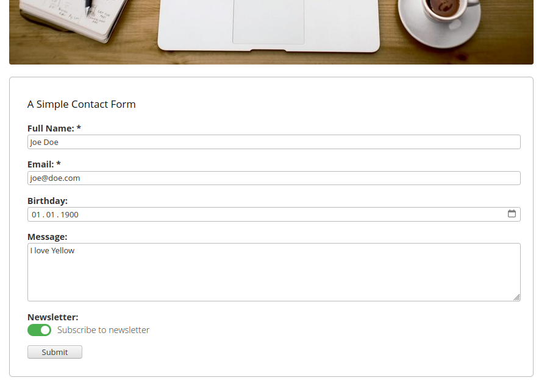

# MDForm 0.0.2 alpha (experimental)
Markdown Form Extension for Datenstrom Yellow

## Screenshot:
<p align="center"></p>

## How to install an extension:
[Download ZIP file](https://github.com/goehte/yellow-mdform/archive/refs/tags/v0.0.2-alpha_bugfix2.zip) and copy it into your `system/extensions` folder.  

[Learn more about Yellow CMS extensions](https://github.com/annaesvensson/yellow-update).

## Introduction
MDForm is a lightweight, flexible form extension for Datenstrom Yellow CMS that allows you to create customized web forms using simple "like Markdown" syntax.

### Main Idea of this Extension
My primary goal was to create a tool that could generate customised web forms within the Yellow CMS environment, save form data directly to a CSV file, and send an email containing the provided form data. 
The MDForm extension provides a simple, file-based approach: you define your form structure in plain text files (.mdf files), and the extension handles everything from HTML generation to data submission and storage.
MDForm is an excellent alternative to Google Forms for Yellow CMS pages, as it keeps your data on your own server while maintaining simplicity and flexibility.

Related Discussion:
github.com/datenstrom/community/discussions/1028

### Features

* Markdown-Based Form Definition: Define forms in simple .mdf text files
* Multiple Field Types Supported: Text, textarea, email, tel, select, radio, checkbox, toggle, date
* Smart Autocomplete: Automatic autocomplete attributes for better UX (email, tel, address, etc.)
* Multiple Output Methods: HTML display, CSV export, email notifications
* Built-in Base Security: CSRF protection, rate limiting, email header sanitization
* Markdown Content Support: Add headings, descriptions, and formatted text within forms
* Multi-language Ready: English and German language support included
* Zero Database Required: Data stored in CSV files or sent via email

---

## Installation
### Requirements
* Datenstrom Yellow CMS
* PHP 7.4 or higher
* Write permissions to system/workers/ folder

### Quick Install (Alpha v0.0.x)
This is the first alpha version (V0.0.x). Installation is straightforward:

Download the mdform.php file
Copy mdform.php to your Yellow CMS system/workers/ folder
Done! The extension loads automatically on next page load

## Example installation path
```
your-site/
├── system/
│   └── workers/
│       └── mdform.php    ← Place the file here
├── media/
│   ├── forms/            ← Create this folder for form definitions
│   └── tables/           ← CSV output will be stored here
└── index.php
```

**Important:** After copying the file, change the default MDFormHashPasskey in the configuration to secure your forms against CSRF attacks.


## Usage
### Creating Your First Form

Create a form definition file in media/forms/ folder (e.g., contact.mdf)

Define your form using Markdown like syntax.

Embed the form in any Yellow CMS page using the [mdform ...] element

### Basic Form Example
#### File: media/forms/contact.mdf
```
*Contact Form:*
Your Name: [Your Name]*
Your Email: [Enter your email]{email}*
Phone Number: [Enter phone]{tel}
A Message: [Tell us more...]
```

#### Page Content (page.md file):
```
[mdform contact.mdf html]
```

---

### Markdown Form Syntax & Supported Field Types (.mdf file)
**Text Input (single line):**
```
Label: [Placeholder text]
Label*: [Required field]*
Email Field (with autocomplete)
Email: [Enter your email]{email}*
Phone Field (with autocomplete)
Phone: [123-456-789]{tel}*
```
**Textarea (multi line):**
```
Message: [Tell us more...]
```
**Number (multiline):**
```
Number of participants: [1;1..5]
```
**Dropdown Select:**
```
Country: [Select country ▼ Germany,France,Spain,Italy]
```
**Radio Buttons:**
```
Gender: [( ) Male, ( ) Female, ( ) Other]
```
**Checkboxes:**
```
Interests: [[ ] Sports, [ ] Music, [ ] Travel, [ ] Reading]
```
**Toggle Switch:**
```
Newsletter: [ON/OFF]
```
**Date Picker:**
```
Birthday: [DD/MM/YYYY]
```
**Markdown Text (Headings, Descriptions):**
```
*Section Title:*
This is a **description** with *formatting*.
```

## Element Usage - Dispatch Options
Control what happens when the form is submitted:
[mdform contact]                    # Just display form
[mdform contact html]               # Display form + show submitted values
[mdform contact csv]                # Display form + save to CSV file
[mdform contact email]              # Display form + send email notification
[mdform contact "html, csv, email"]     # All three methods combined

## Security Warning
⚠️ IMPORTANT: Change this setting in production (public websites):  
`$this->yellow->system->setDefault("MDFormHashPasskey", "some nonsense string");`  
*Use a strong, random string for production environments.*


## File Structure
```
your-site/
├── system/
│   ├── workers/
│   │   └── mdform.php              # Extension file
│   └── config.txt                  # Yellow configuration
├── media/
│   ├── forms/                      # Form definition files (.mdf)
│   │   ├── contact.mdf
│   │   ├── newsletter.mdf
│   │   └── feedback.mdf
│   └── tables/                     # CSV output files
│       ├── contact.csv
│       └── newsletter.csv
└── cache/
    └── mdform/
        └── ratelimit/              # Rate limiting files
```

## Known Issues & Limitations (Alpha Version)
As this is version 0.0.x-alpha, please be aware of the following:

* Rate limiting uses file-based storage (may need optimization for high traffic)
* CSV file backup on header mismatch creates timestamped backups (ensure disk space)
* Email sending depends on server mail configuration
* No built-in CAPTCHA (consider server-side protection for public forms)
* Limited styling (add custom CSS to match your theme)


## Troubleshooting
### Form Not Appearing

Check file exists in media/forms/[formname].mdf
Verify file extension is .mdf, .fmd, .md, or .form
Check file permissions (readable by web server)

### Email Not Sending

Verify MDFormEmail is set correctly in configuration
Check server mail configuration (SMTP, sendmail, etc.)
Review error logs for mail function failures

### CSV Not Being Created

Ensure media/tables/ folder exists
Check write permissions on the folder
Verify MDFormDirectoryCSVOutput setting is correct

### Rate Limiting Too Strict

Edit isRateLimited() method to adjust $waitTime
Or increase timeout value in the code (actual time between submit a form form one IP address is 10s)


## License
GNU GENERAL PUBLIC LICENSE - Feel free to use, modify, and distribute.

## Credits
Special thanks to:
* Giovanni Salmeri for the extension: [Yellow Table](https://github.com/GiovanniSalmeri/yellow-table)
* Anna Svensson for the extension: [Yellow Contact](https://github.com/annaesvensson/yellow-contact/)

Your extensions have been the main inspiration and learning resource for this extension. Thank you for sharing your knowledge with the Yellow CMS community!

## Ideas for improvments:
*Note: No future enhancements planned.*  
Possible ideas for improvements:
 * Develop a CSS for the form elements e.g. to show the Toggle Switch Input as a slider switch we know from smartphones 
 * Develop for security related features (CRLF, Rate Limit, ...) in an own Yellow extension
 * Built-in CAPTCHA integration
 * Multi-page forms
 * E-Mail confirmation of form data
 * Encypted file storage option (storage format TBD)
 * File upload support for images: I suggest to use the extension [Yellow Dropzone](https://github.com/GiovanniSalmeri/yellow-dropzone)

## This is Alpha Software (v0.0.x)
Use in production at your own risk. Back up your data regularly and test thoroughly before deploying to production environments.

**Made with 💛 for the Yellow CMS Community**
