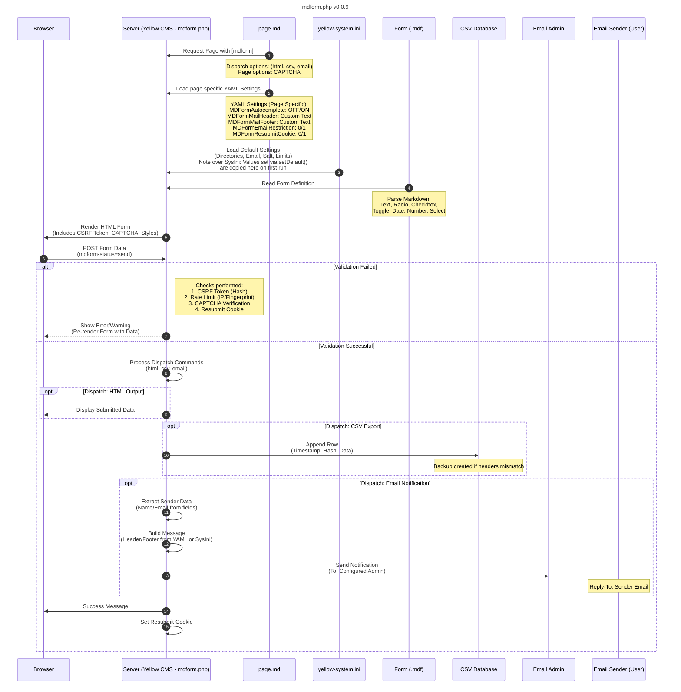

# MDForm VERSION HISTORY

VERSION: 0.0.1 - Inital Comit  
VERSION: 0.0.2 - Number Input added and Date min max added  
VERSION: 0.0.3 - Input Elements optimized URL & Password added, Textareasize is variable  
VERSION: 0.0.4 - Security updates on Rate Limit (Pure IP added)  
VERSION: 0.0.5 - Layout and CSS optimized  
VERSION: 0.0.6 - Slider CSS added  
VERSION: 0.0.7 - Bugfix and error messages improved

---

### Main Idea of this Extension
My primary goal was to create a tool that could generate customised web forms within the Yellow CMS environment, save form data directly to a CSV file, and send an email containing the provided form data. 
The MDForm extension provides a simple, file-based approach: you define your form structure in plain text files (.mdf files), and the extension handles everything from HTML generation to data submission and storage.
MDForm is an excellent alternative to Google Forms for Yellow CMS pages, as it keeps your data on your own server while maintaining simplicity and flexibility.

Related Discussion:
github.com/datenstrom/community/discussions/1028

### Features

* Markdown-Based Form Definition: Define forms in simple .mdf text files
* Multiple Field Types Supported: Text, textarea, email, tel, select, radio, checkbox, toggle, date
* Smart Autocomplete: Automatic autocomplete attributes for better UX (email, tel, address, etc.)
* Multiple Output Methods: HTML display, CSV export, email notifications
* Built-in Base Security: CSRF protection, rate limiting, email header sanitization
* Markdown Content Support: Add headings, descriptions, and formatted text within forms
* Multi-language Ready: English and German language support included
* Zero Database Required: Data stored in CSV files or sent via email

---

### Markdown Form Syntax & Supported Field Types (.mdf file)
**Text Input (single line):**
```
Label: [Placeholder text]
Label*: [Required field]*
Email Field (with autocomplete)
Email: [Enter your email]{email}*
Phone Field (with autocomplete)
Phone: [123-456-789]{tel}*
```
**Textarea (multi line):**
```
Message: [Tell us more...]
```
**Number (multiline):**
```
Number of participants: [1;1..5]
```
**Dropdown Select:**
```
Country: [Select country ▼ Germany,France,Spain,Italy]
```
**Radio Buttons:**
```
Gender: [( ) Male, ( ) Female, ( ) Other]
```
**Checkboxes:**
```
Interests: [[ ] Sports, [ ] Music, [ ] Travel, [ ] Reading]
```
**Toggle Switch:**
```
Newsletter: [ON/OFF]
```
**Date Picker:**
```
Birthday: [DD/MM/YYYY]
```
**Markdown Text (Headings, Descriptions):**
```
*Section Title:*
This is a **description** with *formatting*.
```

## Element Usage - Dispatch Options
Control what happens when the form is submitted:
[mdform contact]                    # Just display form
[mdform contact html]               # Display form + show submitted values
[mdform contact csv]                # Display form + save to CSV file
[mdform contact email]              # Display form + send email notification
[mdform contact "html, csv, email"]     # All three methods combined


## Known Issues & Limitations (Alpha Version)
As this is version 0.0.x-alpha, please be aware of the following:

* Rate limiting uses file-based storage (may need optimization for high traffic)
* CSV file backup on header mismatch creates timestamped backups (ensure disk space)
* Email sending depends on server mail configuration
* No built-in CAPTCHA (consider server-side protection for public forms)
* Limited styling (add custom CSS to match your theme)


## Troubleshooting
### Form Not Appearing

Check file exists in media/forms/[formname].mdf
Verify file extension is .mdf, .fmd, .md, or .form
Check file permissions (readable by web server)

### Email Not Sending

Verify MDFormEmail is set correctly in configuration
Check server mail configuration (SMTP, sendmail, etc.)
Review error logs for mail function failures

### CSV Not Being Created

Ensure media/tables/ folder exists
Check write permissions on the folder
Verify MDFormDirectoryCSVOutput setting is correct

### Rate Limiting Too Strict

Edit isRateLimited() method to adjust $waitTime
Or increase timeout value in the code (actual time between submit a form form one IP address is 10s)

## Ideas for improvments:
*Note: No future enhancements planned.*  

 * E-Mail confirmation of form data
 * Encypted file storage option (storage format TBD)
 * File upload support for images: I suggest to use the extension [Yellow Dropzone](https://github.com/GiovanniSalmeri/yellow-dropzone)

For those who are new to the community, here are some tips and tricks for using the Yellow CMS API:
https://github.com/datenstrom/community/discussions/760



